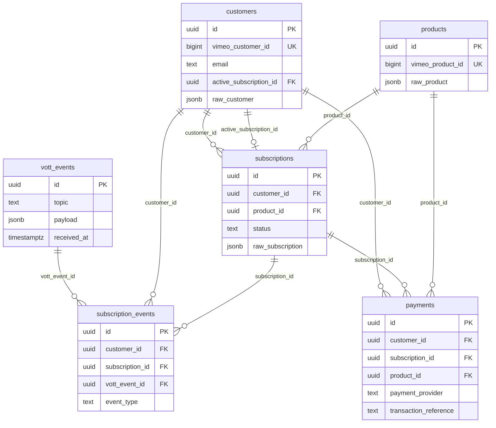

# Database Design

Enterprise Customer Subscription Analytics Platform — Phase 2 schema.

## Architecture Overview

```text
Vimeo Webhooks
      ↓
Raw Event Store (public.vott_events)     ← immutable, forever
      ↓
Event Processing Engine                  ← Phase 3
      ↓
Normalized Database
  customers · products · subscriptions
  subscription_events · payments
      ↓
Analytics Views (vw_*)
      ↓
REST APIs → Admin Dashboard
```

### Why raw webhook events are preserved forever

Every Vimeo delivery is stored in `public.vott_events` with the full `payload jsonb`. That table is the **source of truth** for what Vimeo sent:

- **Replay** — processors can be fixed and re-run without asking Vimeo to resend.
- **Audit** — disputes, compliance, and debugging always have the original JSON.
- **Schema evolution** — new columns or entities can be backfilled from history.
- **Idempotency** — `subscription_events.vott_event_id` ties each derived row to one delivery.

**Do not remove, rename, or alter existing `vott_events` columns.** Normalized tables are projections of this store, not replacements.

### Why normalized tables exist

`vott_events` is append-only and JSON-heavy. Analytics questions (active subscribers, churn, revenue by country) require:

- Stable foreign keys between customers, products, subscriptions, and payments
- Typed columns (cents, statuses, timestamps) for indexes and aggregations
- A **current business state** that is cheap to query

Normalized tables always represent the **latest derived state**. The event store remains the immutable history.

### Why analytics should never query the webhook table directly

Scanning `payload` JSONB for dashboards does not scale:

- No reliable relational joins without extracting nested fields every time
- Topic-specific shapes and null-heavy Send-test payloads break assumptions
- Aggregations cannot use clean indexes on business attributes
- Accidental coupling of BI to Vimeo’s raw envelope makes provider migrations painful

**Rule:** ingest writes `vott_events`; processors write normalized tables; APIs and views read **only** normalized tables (and `vw_*` views).

### Why event sourcing is used

1. Capture every webhook unchanged (`vott_events`).
2. Derive domain entities and lifecycle rows (`subscription_events`).
3. Project current state onto `customers` / `subscriptions` / `payments`.

This separates **facts** (what happened) from **models** (what we believe now), supports reprocessing, and keeps integrations additive.

---

## ER Diagram



---

## Table Descriptions

### `public.vott_events` (Phase 1 — unchanged)

Immutable webhook event store. Primary key `id`. Full body in `payload`. Denormalized lookup columns (`topic`, `customer_id`, `customer_email`, …) exist only for ops browsing — **not** for analytics.

### `public.customers`

One row per Vimeo customer (`vimeo_customer_id` UNIQUE).

| Area | Columns |
|------|---------|
| Identity | `id`, `vimeo_customer_id`, `email`, `first_name`, `last_name`, `full_name`, `external_user_id` |
| Location | `country`, `region`, `city` |
| Snapshot | `platform`, `plan`, `subscription_status`, promo/coupon codes, marketing/registration flags |
| Timeline | `customer_created_at`, `customer_updated_at`, `first_seen_at`, `last_seen_at`, payment dates |
| Pointer | `active_subscription_id` → current open subscription |
| Audit | `raw_customer`, `created_at`, `updated_at` |

Product catalog fields are **not** stored here.

### `public.products`

One row per Vimeo product (`vimeo_product_id` UNIQUE). Money as integer cents plus optional formatted strings. Catalog extras (`sku`, trial flags, content counts) are nullable when absent from a webhook. `raw_product` keeps the last-seen object.

### `public.subscriptions`

One customer may have **many** subscription rows over time. Vimeo does not provide a subscription ID — **our UUID is the identity**.

**Phase 3 matching rule:** find the open row for `(customer_id, product_id)` (see partial unique index). After cancel/expire, a re-subscribe **inserts a new row**.

### `public.subscription_events`

Append-only lifecycle log (`created`, `trial_started`, `trial_converted`, `renewed`, `cancelled`, `expired`, `charge_failed`, `resumed`, `paused`, …).

- Always links to `vott_events` via `vott_event_id` (UNIQUE → one delivery, one event row).
- Has `created_at` only (no `updated_at`) — intentional immutability exception.

### `public.payments`

Provider-agnostic payment attempts. Vimeo may synthesize rows from `renewed` / `charge_failed`; Stripe and others attach via `payment_provider` + `transaction_reference` without redesign.

---

## Relationships

| From | To | Cardinality | Notes |
|------|----|-------------|-------|
| `subscriptions.customer_id` | `customers.id` | N:1 | Required |
| `subscriptions.product_id` | `products.id` | N:1 | Required |
| `customers.active_subscription_id` | `subscriptions.id` | N:1 optional | Set null on delete of subscription |
| `subscription_events.*` | customers / subscriptions / vott_events | N:1 | Restrict deletes |
| `payments.customer_id` | `customers.id` | N:1 | Required |
| `payments.subscription_id` | `subscriptions.id` | N:1 optional | May be unknown early |
| `payments.product_id` | `products.id` | N:1 optional | May be unknown |

FK create order: `customers` → `products` → `subscriptions` (then add `customers.active_subscription_id` FK) → `subscription_events` → `payments`.

---

## Index Strategy

| Kind | Examples | Purpose |
|------|----------|---------|
| Primary key | All `id` columns | Stable joins |
| Unique natural keys | `vimeo_customer_id`, `vimeo_product_id` | Idempotent upserts |
| Unique event link | `subscription_events.vott_event_id` | Processor idempotency |
| Partial unique | Open `(customer_id, product_id)` where not cancelled/expired | One open sub per product |
| Partial unique | `(payment_provider, transaction_reference)` where ref not null | Multi-provider idempotency |
| Filter / sort | email, country, platform, status, billing_frequency, payment_date, event_created_at | Dashboards and APIs |

Secondary indexes live in `011_indexes.sql`. Unique/PK indexes are created with the tables.

---

## Constraints

| Constraint | Why it exists |
|------------|---------------|
| UUID primary keys | Internal identity independent of Vimeo or Stripe IDs |
| `vimeo_*_id` UNIQUE NOT NULL | Safe upsert from webhooks |
| Foreign keys | No orphan subscriptions, events, or payments |
| `active_subscription_id` FK | Fast “current subscription” without denormalizing products onto customers |
| Partial unique open subscription | Prevents duplicate concurrent open rows for the same customer+product |
| Partial unique provider + reference | Stripe/Shopify/Recharge idempotency without schema change |
| Check `*_cents >= 0` | Reject impossible money values |
| `subscription_events.vott_event_id` UNIQUE | Reprocessing the same webhook cannot double-write lifecycle rows |
| RLS enabled, no anon policies | Same pattern as `vott_events`: service role writes; clients cannot mutate |

Shared `set_updated_at()` trigger keeps `updated_at` current on mutable tables.

---

## Analytics Views

Plain SQL views (not materialized), reading **only** normalized tables:

| View | Role |
|------|------|
| `vw_customer_metrics` | Global customer / active / trial stubs |
| `vw_subscription_metrics` | Open / cancelled / frequency stubs |
| `vw_product_metrics` | Per-product subscription and revenue stubs |
| `vw_country_metrics` | By country |
| `vw_platform_metrics` | By platform |
| `vw_daily_metrics` | Daily new customers, subs, payments |

These are placeholders. Later phases extend LTV, cohorts, retention, recovered payments, etc.

---

## Future Scalability

### Event store + projections scale independently

- Hot ingest path only appends to `vott_events`.
- Heavy analytics hit indexed normalized tables and views.
- Backfills and reprocessing never require changing the ingest contract.

### Multi-provider billing without core redesign

`payments` already models:

| Provider | How it attaches |
|----------|-----------------|
| Vimeo OTT | `payment_provider = 'vimeo'`; synthesize from topics when no payment object exists |
| Stripe | `payment_provider = 'stripe'`; `transaction_reference` = PaymentIntent / charge id |
| Shopify | order / transaction ids in `transaction_reference` |
| Recharge | subscription charge ids |
| Custom | same columns; details in `raw_payment` |

Core FKs (`customer_id`, `subscription_id`, `product_id`) stay stable. New providers add rows, not tables.

### Ads and commerce integrations

Attribution systems (Google Ads, Meta Ads) and commerce (Shopify) should join on:

- `customers.email` / `external_user_id`
- `customers.vimeo_customer_id`
- Optional future bridge tables (e.g. `customer_identities`, `ad_attribution_events`) that **reference** `customers.id` — they do not replace the core model.

### Partitioning and performance (later)

When volume grows:

- Partition `vott_events` by `received_date` (already a stored generated column).
- Keep normalized tables as the analytics surface; consider materialized views only when plain views are too slow.
- Never force dashboards to aggregate raw JSONB.

---

## Migration Files

| File | Contents |
|------|----------|
| `005_customers.sql` | `customers` + `set_updated_at()` |
| `006_products.sql` | `products` |
| `007_subscriptions.sql` | `subscriptions` + `customers.active_subscription_id` FK |
| `008_subscription_events.sql` | Append-only lifecycle events |
| `009_payments.sql` | Provider-agnostic payments |
| `010_views.sql` | Placeholder `vw_*` views |
| `011_indexes.sql` | Secondary + partial unique indexes |

Phase 1 files `001`–`004` own `vott_events` and must not be altered by this phase.

---

## Phase boundary

**Phase 2 (this docs + migrations):** schema and documentation only.

**Phase 3:** event processing engine that reads `vott_events` and upserts normalized tables.

**Later:** richer analytics, APIs, and dashboard — all against normalized tables and views.
